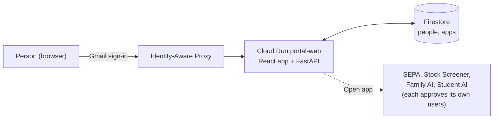

# Vahxa Portfolios

One entry point for the Vahxa apps on Google Cloud. People sign in with their Gmail account and
ask for access to the portal. Once an admin approves them, they see every app and open it from
here.

The portal only controls who can use the portal. **Each app runs its own access requests and
approvals**, so the first time someone opens an app it may ask them to request access inside
that app.

## How it works



1. **Sign-in.** Anyone with a Google account can sign in. IAP verifies the account, and the
   portal reads the verified email from IAP's signed header (`portal/iap.py`).
2. **Request.** Until they're approved, people only see a request page. They enter their name
   and an optional reason, then wait. The page opens the portal by itself within about 20
   seconds of approval. Someone who was denied or revoked can send a new request. Every other
   `/api` route answers `403` until they're approved.
3. **Approve.** Admins see a red count on **Admin** when requests are waiting:
   - **People:** approve or deny requests; approve a Gmail address in advance, before that
     person ever signs in; revoke access; make someone an admin or remove the role.
     Revoking someone also removes their admin role.
   - **Apps:** add, edit or delete apps in the catalog.
4. **Use.** Approved people see every app with an **Open app** link.
5. **Permanent admins.** `PORTAL_ADMINS` (set in `deploy/config.sh`) are always approved admins
   and can't be changed from the app, so it can't lock itself out. Admins can't change their own
   access or role.

The first start adds the four existing apps to the catalog (`portal/catalog.py`). After that,
the catalog is edited only on the Admin page.

## Run locally

```bash
python -m venv .venv
.venv/Scripts/activate                       # macOS/Linux: source .venv/bin/activate
pip install -r requirements.txt pytest httpx
cd frontend && npm install && npm run build && cd ..
uvicorn portal.main:app --port 8080           # http://127.0.0.1:8080
python -m pytest -q                           # offline tests
```

Locally there's no sign-in: you act as `PORTAL_DEV_USER` (default `dev@localhost`), an admin
unless `PORTAL_DEV_ROLE=user` (then you see the request page). Data is saved in `data/portal.json`. For live reload of the UI,
run `npm run dev` in `frontend/` and open http://localhost:5174.

## Deploy to Google Cloud

From this folder, in Git Bash, with `gcloud` signed in as an account on the billing account:

```bash
bash deploy/setup.sh     # first time (~5 minutes): project, billing, APIs, Firestore, image, service, IAP
bash deploy/deploy.sh    # every later release (~2 minutes)
```

`setup.sh` is safe to rerun. It creates the project `vahxa-portfolios`; set `PORTAL_PROJECT` for a
different ID.

### First-time setup in the Cloud Console

Projects outside a Google Workspace organization can't use Google's managed OAuth client, so IAP
needs your own (once):

1. **Consent screen.** In [Google Auth Platform](https://console.cloud.google.com/auth/overview?project=vahxa-portfolios),
   choose **Get started**: app name *Vahxa Portfolios*, your support email, audience
   **External**.
2. **OAuth client.** Under **Clients**, create a **Web application** client. Then add this
   authorized redirect URI, using the new client's ID:
   `https://iap.googleapis.com/v1/oauth/clientIds/<CLIENT_ID>:handleRedirect`.
3. **Point IAP at it.** In [Security → Identity-Aware Proxy](https://console.cloud.google.com/security/iap?project=vahxa-portfolios),
   open the **Cloud Run** resources. On `portal-web`, open **⋮ → Settings**, choose
   **Custom OAuth**, paste the client ID and secret, and **Save**.
4. **Publish.** Under [Audience](https://console.cloud.google.com/auth/audience?project=vahxa-portfolios),
   click **Publish app**. While it's in "Testing", only listed test users can sign in. The portal
   only asks for the email address, which needs no Google verification.
5. **Sign in.** Open the service URL as `vahxa.ai@gmail.com`.

## Layout

| Path | What |
|---|---|
| `portal/main.py` | API routes and the built React app |
| `portal/access.py` | Identity, roles and the portal request/approve/revoke rules |
| `portal/store.py` | Storage: `JsonStore` (local) and `FirestoreStore` (`PORTAL_STORE=firestore`) |
| `portal/catalog.py` | Apps added on the first start |
| `portal/iap.py` | IAP signed-header verification (`IAP_AUDIENCE`) |
| `frontend/` | React + Vite app: the Apps and Admin pages |
| `deploy/` | `config.sh`, `setup.sh`, `deploy.sh` |
